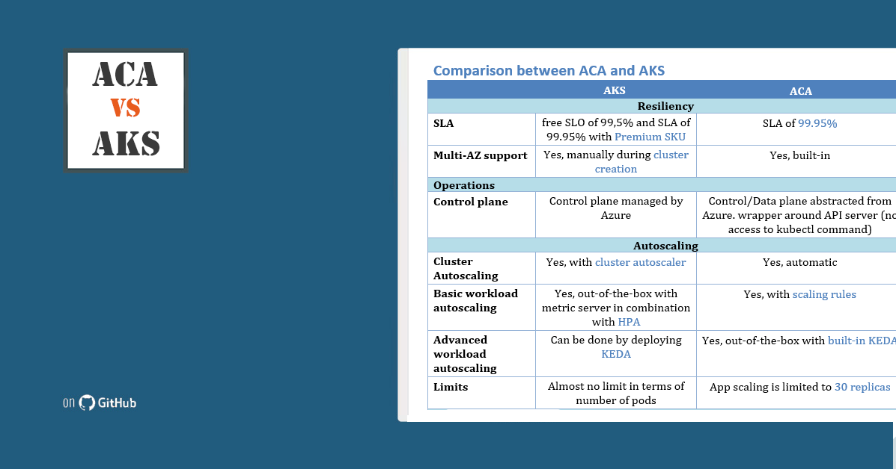

# Azure Containers Apps vs Azure Kubernetes Services

This guide is a tentatively exhaustive comparison guide between ACA and AKS.
The content (in markdown format) can be found [here](src/comparison.md) and a ready-to-use PDF can be found within [Releases](https://github.com/lgmorand/aca-vs-aks/releases).

> Azure Container Apps is a recent platform on Azure and it evolves quite rapidly. This comparison may not be up to date with the very last features.

## Contributors

**[Louis-Guillaume MORAND](https://github.com/lgmorand)**

## License

